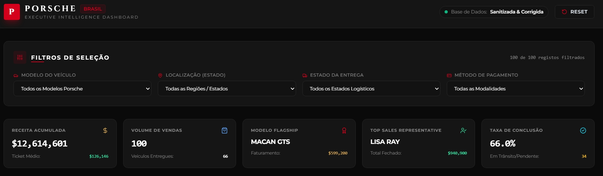

# 🏎️ Porsche Brasil | Executive Intelligence Dashboard

Dashboard de desempenho comercial desenvolvido com base na análise e higienização de dados de vendas de veículos Porsche. O projeto foi concebido com foco em um design **Dark Theme Premium**, alinhado à identidade visual oficial da Porsche.

## 📊 Perguntas de Negócio Escolhidas e Justificativa

1. **Desempenho de Receita por Modelo:**
   - *Por quê:* Identificar quais linhas de veículos (*911, Cayenne, Taycan, etc.*) geram maior faturamento bruto e sustentam a margem de receita da marca.
2. **Eficiência da Equipe de Vendas:**
   - *Por quê:* Avaliar o volume financeiro fechado por cada consultor/vendedor para otimizar comissões e metas comerciais.
3. **Distribuição Geográfica de Mercado:**
   - *Por quê:* Mapear quais estados e regiões concentram a maior concentração de clientes e poder de compra.
4. **Acompanhamento Operacional e Logístico:**
   - *Por quê:* Monitorar o status das entregues (*Delivered, In Transit, Pending*) para garantir eficiência e reduzir gargalos logísticos.
5. **Preferências Financeiras por Modalidade de Pagamento:**
   - *Por quê:* Entender o comportamento de compra dos clientes em relação aos métodos de pagamento utilizados (*Wire Transfer, Financing, Cash, etc.*).

---

## 🛠️ Evolução do Prompt e Construção

- **Prompt Inicial:** Focado apenas em listar os filtros básicos e KPIs textuais.
- **Evolução Iterativa:** Nas versões intermediárias, integramos gráficos interativos com **Chart.js** e refinamos o layout com **Tailwind CSS** utilizando um estilo *glassmorphism*.
- **Versão Final:** Incorporação rigorosa do UI/UX inspirado no site oficial da Porsche Brasil (`#0A0A0A` fundo preto metálico, detalhes em vermelho Porsche `#D5001C`, fontes elegantes e cartões flutuantes).

---

## 🧹 Tratamento e Higienização da Base de Dados

Antes de alimentar a dashboard com a IA, a base de dados passou por etapas críticas de saneamento (realizadas via Python/Pandas):
- **Correção de Datas Inválidas:** Registros com marcações `INVALID` na coluna de data de venda (`SaleDateSanitized`) foram limpos e interpolados chronologicamente com base no ID da transação. E outros campos com valores não idênticos foram corrigidos para evitar erros e deixar todos os informações uniformes.
- **Padronização de Nomes:** Normalização de strings nas colunas de nomes de vendedores (`salesperson`), cidades, estados e modelos para evitar duplicações por divergência de maiúsculas/minúsculas. E deixar os informações mais clara para facilitar a leitura das informacoes.

---

## 🤖 Prompt e Código de Implementação

Para garantir a transparência do desenvolvimento assistido por IA, os artefatos de código e comandos estão disponíveis no repositório:
- **Prompt Utilizado  :** O prompt estruturado enviado à inteligência artificial para conceber o layout minimalista, desportivo e alinhado ao site oficial da Porsche Brasil.
- **Código Fonte  :** O código textual completo em HTML, Tailwind CSS e Chart.js utilizado para renderizar os gráficos e tabelas interativas.

---

## 🚀 Acesso à Dashboard Publicada

- **URL do GitHub Pages:** `https://jeandaedouard1009-eng.github.io/dashboard-vendas-porsche/`

---

> ## 📸 Evidências Visuais (Dashboard Preview) e Planilha Excel

Abaixo está uma pré-visualização da dashboard executiva com o tema Porsche aplicados:

Baixar a planilha : 
